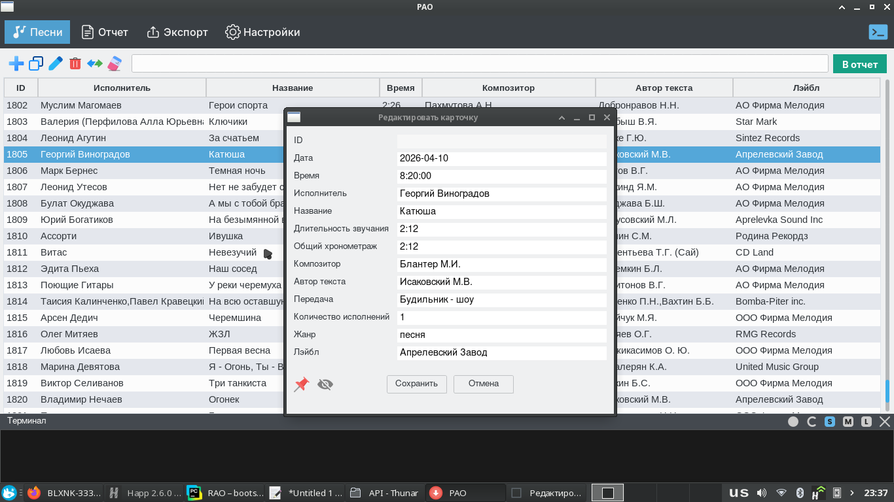
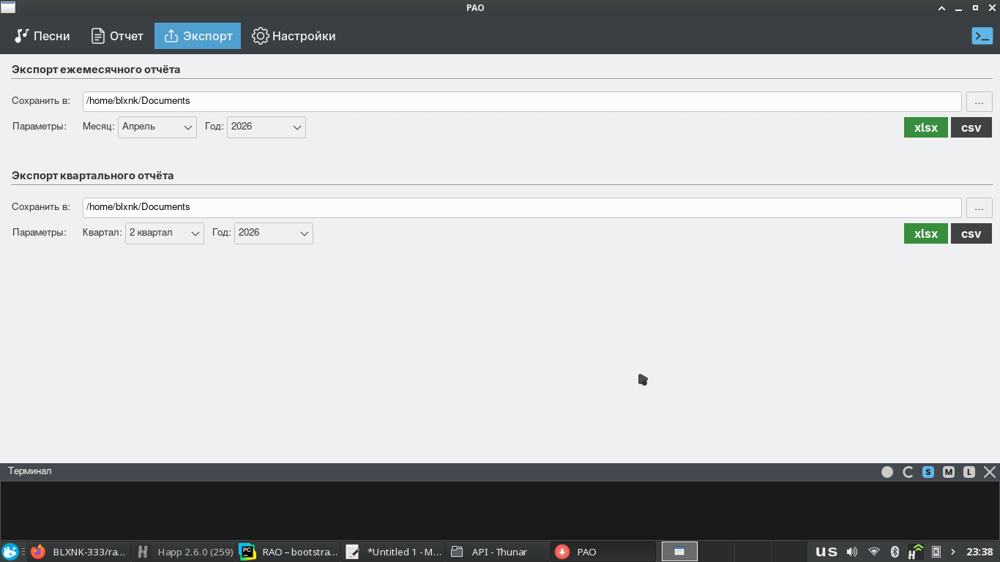

## 📌 Описание

RAO — это десктопное приложение для формирования и экспорта отчётов.  
Позволяет удобно работать с данными и формировать готовые отчёты в несколько кликов.

---

## 🖼️ Скриншоты

### Песни

### Экспорт

---

## 🚀 Запуск

Скачайте последнюю версию программы из раздела **Releases**:

👉 https://github.com/BLXNK-333/rao/releases

После скачивания просто запустите `.exe` файл.

---

## 📁 Важно

При первом запуске база данных создаётся автоматически.

При наличии готового файла базы данных, его можно заменить — достаточно положить файл в директорию с `.exe`, и программа будет использовать его.